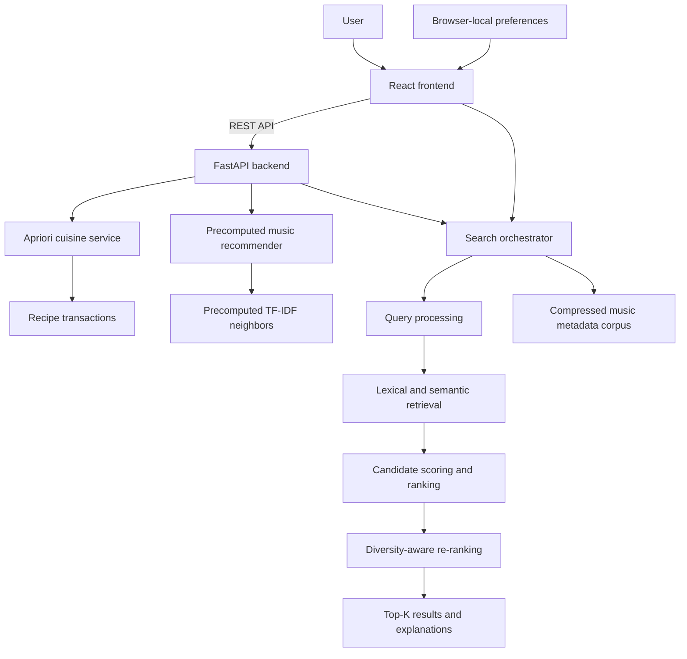

# Recommender System Engine

An experimental search, ranking, and recommendation platform combining machine learning, information retrieval, explainable ranking, and lightweight local personalization.

This is a portfolio-scale implementation demonstrating search and ranking concepts—not a claim of production-scale distributed search infrastructure.

## Features

- Apriori cuisine recommendations with support, confidence, and lift.
- Existing TF-IDF/cosine-similarity music recommendations.
- Natural-language lexical, semantic, and hybrid catalog retrieval.
- Candidate generation, feature scoring, ranking, diversity re-ranking, and Top-K selection.
- Browser-local preferences and generic-versus-personalized comparisons.
- Explainable component scores for every search result.
- Programmatic Precision@K, Recall@K, MRR, and NDCG@K implementations.
- React, FastAPI, Docker Compose, GitHub Actions, and Render support.

## Frontend journey

The page follows the same order as its navigation: Overview, How It Works, Search, Cuisine, and Music. Search begins with a natural-language description, while Similar Sounds begins with an exact known title. Each interactive form includes keyboard-accessible examples; cuisine examples are selected from the supported-cuisine API response, and music examples are verified keys from the recommendation index.

## Architecture



## Repository layout

```text
backend/                    FastAPI application, services, schemas, and tests
frontend/                   React/Vite application and editorial design system
scripts/build_search_corpus.py
recipes.json                Cuisine recipe transactions
music_recommendations.json  Precomputed TF-IDF music neighbors
music_search_corpus.json.gz Deployable title/description/brand search corpus
meta_Digital_Music.json.gz  Source metadata; excluded from Docker images
docker-compose.yml
.github/workflows/ci.yml
```

## Recommendation engines

### Cuisine: Apriori

The backend filters recipes by cuisine, treats ingredients as transactions, and runs Apriori. Rules with confidence of at least `0.5` and lift above `2` are returned. Support measures combination frequency, confidence measures conditional occurrence, and lift compares the relationship with chance.

### Music: TF-IDF and cosine similarity

The original offline pipeline combines available description fields, builds TF-IDF vectors, computes cosine similarity, and stores ten neighbors per title. The deployed API loads `music_recommendations.json` rather than rebuilding pairwise similarities during startup.

## Search and ranking

### Real search corpus

`scripts/build_search_corpus.py` extracts title, description, and brand for the 17,312 deployed music titles. It writes a deterministic compressed corpus. Category data is effectively absent for these records, so the application does not claim genre matching.

```bash
python scripts/build_search_corpus.py
```

### Retrieval modes

- **Lexical:** TF-IDF word/bigram vectors with cosine scoring.
- **Semantic:** latent-semantic sentence/document embeddings built with truncated SVD over TF-IDF and searched through a local scikit-learn cosine index.
- **Hybrid:** lexical, semantic, and available brand-metadata signals.

The latent-semantic approach avoids transformer downloads and FAISS deployment weight while providing a legitimate local embedding/index pipeline suitable for limited Render resources.

### Multi-stage pipeline

1. Normalize and vectorize the query.
2. Retrieve a candidate pool larger than Top-K.
3. Calculate lexical, semantic, metadata, and optional preference features.
4. Rank candidates using centralized weights.
5. Re-rank with duplicate suppression and semantic MMR diversity.
6. Return Top-K results with signal-supported explanations.

Default hybrid relevance:

```text
0.45 × lexical + 0.45 × semantic + 0.10 × metadata
```

Personalized ranking adds `0.25 × personalization` before re-ranking. Environment variables control every weight.

## Personalization and privacy

No account or database is required. The frontend stores explicitly entered favorite terms, liked/disliked titles, and recent searches in browser `localStorage`. Preferences are sent with a request for transient scoring and are never persisted by the backend. Comparison mode returns generic and personalized rankings from the same candidate pool.

## Learning-to-Rank limitation

There are no independent query-document relevance labels. Precomputed TF-IDF neighbors cannot be reused as unbiased ground truth for systems being compared. No XGBoost/LambdaMART model or fake labels are therefore created. The feature/ranking boundary supports a future labeled dataset, while the weighted baseline remains functional.

## Evaluation

The backend implements Precision@K, Recall@K, MRR, and graded NDCG@K. Tests calculate them from explicit relevance fixtures. The dashboard displays `N/A` for repository-wide comparisons because no valid evaluation judgments exist; metric values are never hard-coded or fabricated.

## Multimodal limitation

The source data contains some external image URLs but no local, licensed image corpus tied to deployable records. Multimodal retrieval is reported as unavailable rather than downloading arbitrary images or claiming unevaluated image support.

## Explainability

Results expose lexical, semantic, metadata, personalization, ranking, and re-ranking scores. Explanations are conditional: preference explanations appear only when preference scoring affected the result, for example.

## REST API

| Method | Endpoint | Purpose |
|---|---|---|
| `GET` | `/api/health` | Render health check |
| `GET` | `/api/cuisines` | Supported cuisines |
| `GET` | `/api/recommendations/cuisine/{cuisine}` | Apriori recommendations |
| `GET` | `/api/music/titles?q=` | Music autocomplete |
| `GET` | `/api/recommendations/music?title=` | Existing music recommendations |
| `POST` | `/api/search` | Lexical, semantic, or hybrid ranking |
| `GET` | `/api/search/capabilities` | Models and honest limitations |
| `GET` | `/api/search/evaluation` | Evaluation availability |

Example:

```json
{
  "query": "uplifting acoustic worship music",
  "mode": "hybrid",
  "top_k": 5,
  "personalize": true,
  "compare": false,
  "preferences": {
    "favorite_terms": ["acoustic", "gospel"],
    "liked_titles": [],
    "disliked_titles": [],
    "recent_searches": []
  }
}
```

FastAPI validates blank queries, retrieval modes, Top-K (`1–20`), and preference lengths.

## Local development

Backend:

```bash
cd backend
python -m venv .venv
# Windows: .venv\Scripts\activate
# macOS/Linux: source .venv/bin/activate
pip install -r requirements.txt
python run.py
```

Frontend:

```bash
cd frontend
cp .env.example .env
npm install
npm run dev
```

```env
VITE_API_BASE_URL=http://localhost:8000
```

Do not commit real `.env` files.

## Environment variables

Backend defaults:

```env
CORS_ORIGINS=http://localhost:5173
PORT=8000
```

Optional configuration:

```env
RECIPES_PATH=../recipes.json
MUSIC_RECOMMENDATIONS_PATH=../music_recommendations.json
MUSIC_SEARCH_CORPUS_PATH=../music_search_corpus.json.gz
SEARCH_SEMANTIC_DIMENSIONS=64
SEARCH_LEXICAL_WEIGHT=0.45
SEARCH_SEMANTIC_WEIGHT=0.45
SEARCH_METADATA_WEIGHT=0.10
SEARCH_PERSONALIZATION_WEIGHT=0.25
SEARCH_DIVERSITY_WEIGHT=0.12
```

Multiple origins are comma-separated:

```env
CORS_ORIGINS=http://localhost:5173,https://your-frontend-service.onrender.com
```

## Tests and CI

```bash
cd backend
pytest

cd ../frontend
npm run build
```

GitHub Actions runs backend tests and a production frontend build on pushes and pull requests.

## Docker Compose

```bash
docker compose up --build
```

The backend image copies deployable datasets and exposes `8000`. The frontend is built with `VITE_API_BASE_URL`, served by Nginx on `5173`, and waits for the backend health check.

## Deployment on Render

Backend and frontend remain separate services in one repository.

### Backend

1. Push the repository to GitHub.
2. Create a Render service using repository-root Docker build context.
3. Dockerfile path: `backend/Dockerfile`.
4. Add `CORS_ORIGINS`, initially including local development if needed.
5. Deploy and verify `/api/health`.
6. Copy the backend URL.

Docker is the recommended backend path because all root-level datasets are copied explicitly. For a native service, use root directory `backend`, build command `pip install -r requirements.txt`, start command `python run.py`, and configure dataset paths to accessible repository files.

### Frontend

1. Create a Render Static Site with root directory `frontend`.
2. Build command: `npm install && npm run build`.
3. Publish directory: `dist`.
4. Set `VITE_API_BASE_URL=https://your-backend-service.onrender.com`.
5. Deploy and copy the frontend URL.
6. Set backend `CORS_ORIGINS` to that exact origin (comma-separated with others).
7. Redeploy the backend when environment values change.
8. Verify health, cuisine, music, all search modes, comparison mode, and evaluation availability.

Never hard-code Render URLs.

## Deployment considerations

- Models/indexes load once per process and are reused.
- No paid API, database, external model download, or vector service is required.
- The compressed search corpus is roughly 4 MB; raw metadata is excluded from Docker.
- Semantic initialization adds cold-start work but no per-request refitting.
- Each Render process owns its in-memory index; this is not a distributed search system.

## Data note

Review source dataset terms before redistributing or using this educational data outside the portfolio project.
